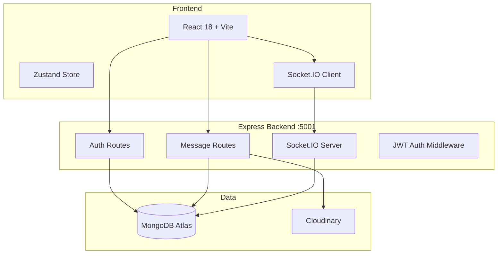

<p align="center">
  
  
  
  
  
  
</p>

# MoyoChat — Real-Time Chat Application

A full-stack real-time messaging platform with JWT authentication, media sharing, online presence tracking, and a modern React UI.

## Architecture



## Tech Stack

| Layer | Technology |
|-------|-----------|
| **Frontend** | React 18, Vite, Zustand, React Router v6, Lucide React |
| **Backend** | Node.js, Express 5, Mongoose 9 |
| **Database** | MongoDB Atlas |
| **Real-time** | Socket.IO 4 |
| **Media** | Cloudinary |
| **Auth** | JWT, bcryptjs, httpOnly cookies |
| **Email** | Nodemailer (password reset) |

## API Reference

### Auth — `/api/auth`

| Method | Endpoint | Auth | Description |
|--------|----------|------|-------------|
| POST | `/signup` | — | Register new user |
| POST | `/login` | — | Login |
| POST | `/logout` | — | Logout |
| POST | `/forgot-password` | — | Send password reset code |
| POST | `/reset-password` | — | Reset password |
| PUT | `/update-profile` | ✓ | Update profile with image |
| GET | `/check` | ✓ | Check auth status |

### Messages — `/api/messages`

| Method | Endpoint | Auth | Description |
|--------|----------|------|-------------|
| GET | `/users` | ✓ | Get users for sidebar |
| GET | `/:id` | ✓ | Get conversation with user |
| POST | `/send/:id` | ✓ | Send message to user |

### Socket.IO Events

| Event | Direction | Description |
|-------|-----------|-------------|
| `newMessage` | Server → Client | Incoming message notification |
| `sendMessage` | Client → Server | Send a new message |
| `userConnected` | Server → Client | User came online |
| `userDisconnected` | Server → Client | User went offline |

## Quick Start

```bash
# Clone
git clone https://github.com/Tochiiy/Full-Stack_Moyo_Chat-app.git
cd Full-Stack_Moyo_Chat-app

# Backend
cd Backend
npm install
# Create .env:
#   MONGODB_URI=
#   JWT_SECRET=
#   CLOUDINARY_CLOUD_NAME=
#   CLOUDINARY_API_KEY=
#   CLOUDINARY_API_SECRET=
#   SMTP_HOST=, SMTP_PORT=, SMTP_USER=, SMTP_PASS=
#   FRONTEND_URL=http://localhost:5173
npm run dev

# Frontend
cd ../Frontend
npm install
npm run dev
```

## Project Structure

```
Full-Stack_Moyo_Chat-app/
├── Backend/                    # Express API
│   ├── src/
│   │   ├── server.js           # Entry point
│   │   └── controllers/        # auth, message controllers
│   ├── lib/                    # cloudinary, database, email, socket.io, utilities
│   ├── models/                 # User, Message schemas
│   ├── routes/                 # auth, message routes
│   └── middleware.js/          # auth middleware
├── Frontend/                   # React SPA
│   └── src/
│       ├── components/         # ChatPanel, Sidebar, PageNav
│       ├── pages/              # 10 pages
│       ├── store/              # useAuthStore (Zustand)
│       └── lib/                # axios, socket.io config
└── package.json                # Monorepo root
```

## Features

- **Real-time messaging**: Instant message delivery via Socket.IO
- **User authentication**: JWT with httpOnly cookies
- **Profile management**: Update profile picture and info
- **Online presence**: Green dot indicator for active users
- **Media sharing**: Images uploaded via Cloudinary
- **Password reset**: Email-based recovery flow
- **Responsive design**: Works on desktop and mobile
